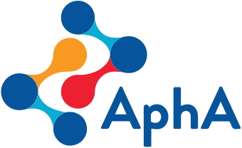

# Presentations

## Mortality surveillance

 

East Midlands [AphA (Association of Professional Healthcare Analysts)](https://www.aphanalysts.org/) branch meeting 1st November 2019.

I used this presentation to cover the steps I took (and mistakes I made) in creating one table from many sources in SQL for mortality surveillance within a large NHS secondary care provider trust.

* [Slides](https://lextuga007.github.io/Presentations/mortality/MortalitySQL.html)
 
* [Code](https://github.com/Lextuga007/Presentations/tree/main/mortality)

---

## Mortality analysis using R

 

 
 
 

 

I presented this particular presentation at:

* East Midlands [AphA (Association of Professional Healthcare Analysts)](https://www.aphanalysts.org/) branch meeting 1st November 2019
* R-Ladies London 30th July 2019 
* NHS-R Community Conference 4-5th November 2019 lightning talk [NHS-R Community](https://nhsrcommunity.com/) 

I used this presentation to show how I had used R to create a mortality surveillance report. It is related to the [Mortality surveillance slides](https://lextuga007.github.io/Presentations/mortality/MortalitySQL.html) in that this was the analysis part of the surveillance. 

* [Slides](https://lextuga007.github.io/Presentations/mortality/MortalityR.html#1)
 
* [Code](https://github.com/Lextuga007/Presentations/tree/main/mortality)

This presentation includes a dygraph chart which I've also written about how to create for the NHS-R Community:  

* [Blog](https://nhsrcommunity.com/blog/dygraphs )
 
* [Code](https://github.com/Lextuga007/NHSR_blogs/blob/master/Dygraphs_ZTurner_201909/Dygraphs%20blog.Rmd)

---

## Lightning Talk Women In Tech

Lightning talk (5 mins): Equality in NHS Analysis, December 2019

* [Slides](https://github.com/Lextuga007/Presentations/blob/main/women-in-tech/LightningTalkNHSR.pdf)
 
* [Code]()

I presented at [Women In Tech in Nottingham](https://www.technottingham.com/wit-notts) to show some of the numbers (visually) around the male/female ratio of attendees to the  courses and meetups I've helped to arrange in Nottingham.

It was also a way of showing how 20% is more meaningful when related to a real situation.

The presentation was built in R Markdown and used the viridis package for accessible and contrasting colours, and the waffle package to represent numbers/people.

---

##  Meetup

* [Slides](https://lextuga007.github.io/Presentations/nhsr-meetup/qicharts2.html)
 
* [Code](https://github.com/Lextuga007/Presentations/tree/main/nhsr-meetup)

The presentation was a brief introduction to the [qicharts2](https://cran.r-project.org/web/packages/qicharts2/vignettes/qicharts2.html) package and I used Crimea war numbers as collected by Florence Nightingale. 

---

##  Conference 2020

Lightning talk (10 mins): Why do I need to learn R when I can use SQL? on Monday 9th November 2020. 

* [Slides](https://lextuga007.github.io/Presentations/nhsr-conference-2020/SQLRTalk.html) 
 
* [Code](https://github.com/Lextuga007/Presentations/tree/main/nhsr-conference-2020)

Slides incorporated the NHS and Nottinghamshire Healthcare NHS Foundation Trust fonts, colours and backgrounds courtesy of the [workshop](https://spcanelon.github.io/xaringan-basics-and-beyond/index.html) by Silvia Canelón.

---

## Midlands Analyst Huddle

Festive Christmas presentation 17 December 2020: slides with snow, Christmas jokes and Christmas facts (from ONS and the Met office).

* [Slides](https://lextuga007.github.io/Presentations/midlands-huddle/ice-breaker.html) 
 
* [Code](https://github.com/Lextuga007/Presentations/tree/main/midlands-huddle)

Presentation on AphA and NHS-R (not given on the day):

* [Slides](https://lextuga007.github.io/Presentations/midlands-huddle/apha-nhsr.html#3)
 
* [Code](https://github.com/Lextuga007/Presentations/tree/main/midlands-huddle)