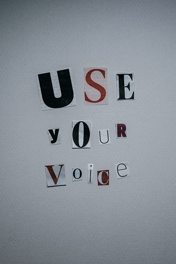

class: title-slide, left, bottom

```{r setup, include = FALSE}
library(knitr)
library(tidyverse)

### Packages not on CRAN ###

# install.packages("remotes")
# remotes::install_github("mitchelloharawild/icons")
library(icons) # icons need to be loaded to view so run following code if not already done
# icons::download_fontawesome()

# install.packages("devtools")
#devtools::install_github("gadenbuie/xaringanExtra")
library(xaringanExtra)
xaringanExtra::use_share_again() # need to get the slide button on html view

# set default options
opts_chunk$set(echo = FALSE,
               fig.width = 7.252,
               fig.height = 4,
               dpi = 300,
               dev.args = list(type = "cairo"),
               eval = TRUE,
               warning = FALSE,
               message = FALSE,
               error = FALSE)

```

```{r echo=FALSE}
# Adds logo to all slides

xaringanExtra::use_logo(
  image_url = "https://cdu-data-science-team.github.io/assets/logo/nottshc-cdu-data-science-logo-800.png",
  link_url = "https://cdu-data-science-team.github.io/team-blog/",
  exclude_class = c("inverse", "hide-logo"),
  width = "300px",
  height = "200px",
  position = css_position(top = "0em", right = "0em")
)
```

# `r rmarkdown::metadata$title`
----
## **`r rmarkdown::metadata$subtitle`**
### `r rmarkdown::metadata$author` | `r format(Sys.time(), '%B %Y')`  

---
class: inverse, middle, center

# Not a typical journey


???

A nice contrast to Sammi and perhaps many people watching this is that many analysts in the NHS don't have data science degrees or masters, or even numerate degrees.

---
class: inverse-white, middle, center

# My background

--

I studied Philosophy as an undergraduate degree

--

My first job after university was on an IT helpdesk

--

My first job in the NHS was as a secretary

--

I was an analyst for about 10 years and I've worked in 2 NHS organisations that no longer exist

???

None of this is to dissuade anyone from doing a degree or a masters, in fact, I've been interested in doing one myself but need to find the time! This is to illustrate how there isn't a typical analyst/data scientist route into the NHS.

---

class: inverse, middle, center

# Benefits of working for the NHS

---

# Data  
  
.center2[

]

???
*Data* - I love transforming data and the complexity of healthcare data. I'm pretty sure my analytical skills are transferable but there is nothing quite like healthcare data in all its messy glory!

Image: Photo by Anna Nekrashevich: https://www.pexels.com/photo/magnifying-glass-on-top-of-document-6801648/

---

# People

.center2[

]

???
*People* - finding the right team matters and working to make the lives of the people around me matters too. I feel strongly that I am a patient, my family and friends are patients and I want these services to be the best they can be. 

Image: Photo by Davi Pimentel: https://www.pexels.com/photo/man-wearing-brown-hoodie-2064826/

---

# Change

.center2[

]

???

*Changes* - We are not exactly start ups in the NHS and things can go exceedingly slowly but working with analysts who have been using R for the best part of 15 years, I hear from them how hard things were then compared to now (thanks to NHS-R Community and PyCom). 

It's easy to not to see how far things have changed and how close we are to the cusp of, I hope, momentous change for the analyst profession as a whole.

Image: Photo by Polina Kovaleva: https://www.pexels.com/photo/use-your-voice-inscription-on-gray-background-6185245/

---
class: inverse

name: acknowledgement

# Acknowledgments

Acknowledgements: the professional look of this presentation, using NHS and Nottinghamshire Healthcare NHS Foundation Trust colour branding, exists because of the amazing work of Silvia Canelón, details of the workshops she ran at the [NHS-R Community conference](https://spcanelon.github.io/xaringan-basics-and-beyond/index.html), Milan Wiedemann who created the CDU Data Science logo with the help of the team and Zoë Turner for putting together the slides.

[`r icons::fontawesome("twitter")` @DataScienceNott](https://twitter.com/DataScienceNott)  
[`r icons::fontawesome("github")` Clinical Development Unit Data Science Team](https://github.com/CDU-data-science-team)  
[`r icons::fontawesome("paper-plane")` cdudatascience@nottshc.nhs.uk](mailto:cdudatascience@nottshc.nhs.uk)

