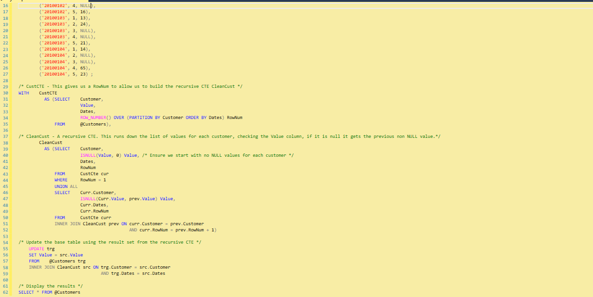
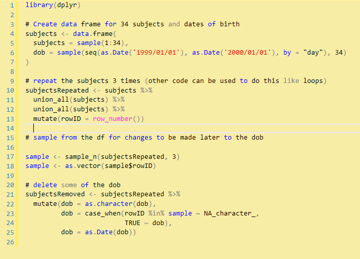
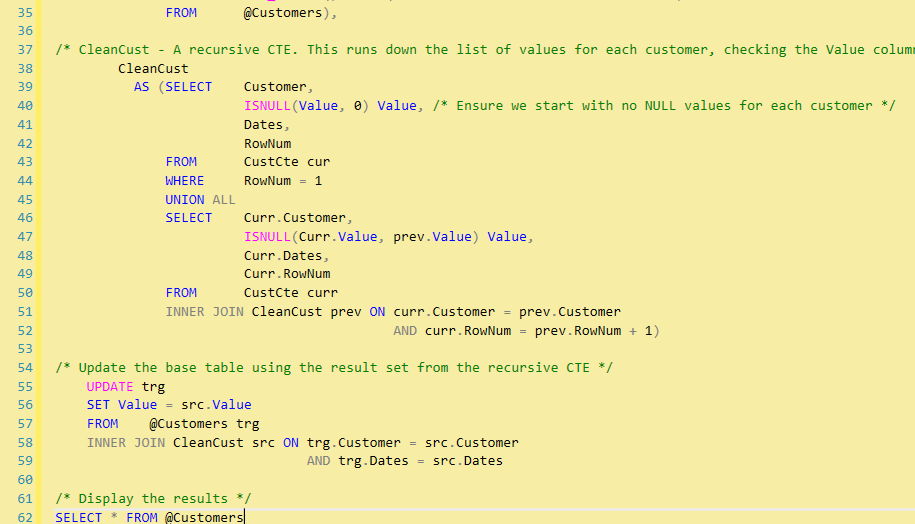

```{r libs, include=FALSE}

#knitr::opts_chunk$set(echo = FALSE, message = FALSE, warning = FALSE, results = 'asis')

#Runs packages if available
library(knitr)
library(magick)
library(qicharts2)
library(tidyverse)
library(stringr)
library(xaringan)

# Packages not on CRAN

# install.packages("remotes")
# remotes::install_github("mitchelloharawild/icon")
library(icon) # icons need to be loaded to view so run following code if not already done
# icon::download_fontawesome()

# install.packages("devtools")
#devtools::install_github("gadenbuie/xaringanExtra")
library(xaringanExtra)


# Note video will only run when opened in browser, won't run in Xaringan view or when knitted.

xaringanExtra::use_panelset()
xaringanExtra::use_clipboard()

source("data/generateRdata.R")

opts_chunk$set(echo = FALSE,
               fig.width = 7.252,
               fig.height = 4,
               dpi = 300)

```

name: hello
class: title-slide, right, bottom

# `r rmarkdown::metadata$title`
----
## `r rmarkdown::metadata$author`
## `r rmarkdown::metadata$date`

---

### Why a talk on this?

.pull-left[

 

]

.pull-right[

* Analysts in the NHS and Local Authorities use SQL and Excel for their analysis.

* 'I can do everything I learned in the introduction course in SQL. Why do I need R?'

* Really, what's all the fuss about?
]


---

### SQL SPC

.left-col[.center[
<video width="640" height="470" controls>
  <source src="videos/SPC_SQL_code_words.mp4" type="video/mp4">
</video>
]]

.footnote[SPC = Statistical Process Control]
---

background-image: url("https://media.giphy.com/media/KZNGTvSbtlHR90BpyM/giphy.gif")
background-position: center
background-size: contain

---


### A better way is to...


.pull-left[Use a package like [qicharts2](https://cran.r-project.org/web/packages/qicharts2/index.html) from CRAN (or [runcharter](https://github.com/johnmackintosh/runcharter) or [spcccharter](https://github.com/johnmackintosh/spccharter) by @_johnmackintosh and code can be as small as this...

```{r SPC, echo=TRUE, eval=FALSE}

qic(month, n, days,
    data     = hospital_infections,
    facets   = infection ~ hospital, #<<
    chart    = 'u',
    multiply = 10000,
    scales   = 'free_y',
    x.angle  = 45,
    title    = 'Hospital acquired infections in the Capital Region of Denmark',
    ylab     = 'Cases per 10,000 risk days',
    xlab     = 'Month')
```
]

--

.pull-right[...creating multiple charts in one go 
```{r ref.label="SPC", echo=FALSE}

# ref.label is using the code from the previous chunk. This time it's printing the charts and not the code.

```
]


---
class: middle, center

## But this isn't about charts, this is about code...

So let's compare R and SQL coding to create dummy/fake data

---

### SQL 

.pull-left[

 
 ]

.pull-right[

* 76 lines of code

* I may have many years' experience but I spent several hours learning to produce fake data

* this requires a server to run, even when using dummy data

]

---

### And now in R

.pull-left[



]

.pull-right[

* 25 lines of code

* I have 2 years' experience and took less than an hour to produce fake data

* This only requires R/RStudio (free software) and existing hardware (my laptop)
]

---


### Filling down 

Imagine you have some data and you want to [fill the empty cells with previous row value](https://stackoverflow.com/questions/3465847/sql-how-to-fill-empty-cells-with-previous-row-value): 

```{r Example from Stackoverflow, echo=FALSE}

#https://cran.r-project.org/web/packages/datapasta/index.html 

example <- tibble::tribble(
  ~Dates, ~Customer, ~Value,
  20100101, 1, 12, 
  20100101, 2, NA, 
  20100101, 3, 32, 
  20100101, 4, 42, 
  20100101, 5, 15, 
  20100102, 1, NA, 
  20100102, 2, NA, 
  20100102, 3, 39, 
  20100102, 4, NA ,
  20100102, 5, 16, 
  20100103, 1, 13, 
  20100103, 2, 24, 
  20100103, 3, NA, 
  20100103, 4, NA, 
  20100103, 5, 21, 
  20100104, 1, 14, 
  20100104, 2, NA, 
  20100104, 3, NA, 
  20100104, 4, 65, 
  20100104, 5, 23) 

example %>% 
  slice(1:10) %>% 
  arrange(Customer) %>% 
  knitr::kable(format = "html")

```

---

### SQL code requires CTE
<br/>

... roughly 34 lines of SQL code



.footnote[CTE = Common Text Expression]

---

### R code 
<br/>

.pull-left[
In contrast, R only take 1 line of code 

```{r R code, echo=TRUE, eval=FALSE}

example %>% 
  fill(Rule, .direction = 'down')

```
]
.pull-right[
leaving lots of space for a GIF


]
---

### Still not convinced...

.pull-left[

]

.pull-right[
**Let's see if I can convince you with...**

]

---

### Two words...

--


.pull-right[

# Pivot Tables

]

---

### Pivoting 

.panelset[
.panel[.panel-name[Long to Wide data]

.pull-left[
Let's take a small long data set like this...

```{r examplePivot, echo=FALSE}
examplePivot <- tibble::tribble(
   ~Patient, ~System, ~DateofBirth_sk,
  1, 'S1', 19680103,
  1, 'RIO', 19680103,
  1, 'IAPT', 19680103,
  3, 'S1', 19970509,
  4, 'RIO', 19471209,
  5, 'S1', 19660321,
  6, 'IAPT', 19780131)

examplePivot %>% 
  knitr::kable(format = "html")
```
]
.pull-right[
and turn it into this wide...

```{r wideData, echo=FALSE}
library(tidyr)

wideData <- examplePivot %>% 
  mutate(value = 1) %>%
  select(-DateofBirth_sk) %>% 
  pivot_wider(names_from = System,
              values_from = value, 
              values_fill = 0)
```

```{r wideDataTable, echo=FALSE}
wideData %>% 
  knitr::kable(format = "html")
```
]
] <!--end-->

.panel[.panel-name[SQL operators]
.green[Hard coded]

```{r, eval=FALSE, echo=TRUE}
SELECT *
FROM 
(
  SELECT Patient, Service, DateofBirth_sk
  FROM #patients
) AS src
PIVOT
(
  COUNT(DateofBirth_sk)
  FOR Service IN ([S1], [RIO], [IAPT])
) AS pivt;

```
] <!--end-->

.panel[.panel-name[SQL Joins]
.green[Code is verbose]

```{r, eval=FALSE, echo=TRUE}
SELECT p.Patient
,CASE WHEN S1.Patient IS NULL THEN 0 ELSE 1 END AS S1
,CASE WHEN rio.Patient IS NULL THEN 0 ELSE 1 END AS RIO
,CASE WHEN iapt.Patient IS NULL THEN 0 ELSE 1 END AS IAPT
FROM #patients AS p
LEFT JOIN (SELECT Patient
			,Service
			FROM #patients
			WHERE Service = 'S1') AS S1 ON S1.Patient = p.Patient
LEFT JOIN (SELECT Patient
			,Service
			FROM #patients
			WHERE Service = 'RIO') AS rio ON rio.Patient = p.Patient
GROUP BY p.Patient
,CASE WHEN S1.Patient IS NULL THEN 0 ELSE 1 END
,CASE WHEN rio.Patient IS NULL THEN 0 ELSE 1 END
```
] <!--end-->

.panel[.panel-name[SQL CASE WHEN]
.green[Flexible and concise]
```{r, eval=FALSE, echo=TRUE}
SELECT Patient
,DateofBirth_sk
,S1				    = MAX(CASE WHEN Service = 'S1' THEN 1 ELSE 0 END)
,Rio					= MAX(CASE WHEN Service = 'RIO' THEN 1 ELSE 0 END)
,IAPT					= MAX(CASE WHEN Service = 'IAPT' THEN 1 ELSE 0 END)
FROM #patients
GROUP BY Patient
,DateofBirth_sk
ORDER BY Patient
```
] <!--end-->

.panel[.panel-name[R code]
.green[About the same amount of code in this example but many more services could be added with no need for more coding.]

```{r ref.label="wideData", eval=FALSE, echo=TRUE}
# Show code from previous chunk where run for example
```

] <!--end-->

.panel[.panel-name[R code - cont]
.green[It's also possible to move data from wide to long and repeat this within the same amount of code... as many times as required]

```{r, eval=FALSE, echo=TRUE}
library(tidyr)

examplePivot %>% 
  mutate(value = 1) %>%
  select(-DateofBirth_sk) %>% 
  pivot_wider(names_from = System,
              values_from = value,
              values_fill = 0) %>% 
  pivot_longer(cols = -Patient,
               names_to = "service",
               values_to = "values")
```

] <!--end-->
] <!--end of panelset-->

---

### Dummy Data

.panelset[
.panel[.panel-name[SQL Dummy Data]
.green[Based on real life example of having multiple databases]

```{r, eval=FALSE, echo=TRUE}
CREATE TABLE #patients (
   Patient integer,
     Service varchar(5),
	 DateofBirth_sk int
);
INSERT  INTO #Patients
    VALUES  (1, 'S1', 19680103),
			(1, 'RIO', 19680103),
			(1, 'IAPT', 19680103),
			(3, 'S1', 19970509),
			(4, 'RIO', 19471209),
			(5, 'S1', 19660321),
			(6, 'IAPT', 19780131)

```
] <!--end-->

.panel[.panel-name[R Dummy Data]
.green[Based on real life example of having multiple databases]

```{r ref.label="examplePivot", eval=FALSE, echo=TRUE}
# Show code from previous chunk where run for example
```
] <!--end-->
] <!--end of panelset-->
---
name: goodbye
class: middle, inverse

# **Thank you!**
<br/>

Acknowledgements: the professional look of this presentation, using NHS and Nottinghamshire Healthcare NHS Foundation Trust colour branding, exists because of the amazing work of Silvia Canelón, details of the workshops she ran at the [NHS-R Community conference](https://spcanelon.github.io/xaringan-basics-and-beyond/index.html).

Thanks too to Simon Wellesley-Miller who ran an [R Markdown workshop](https://github.com/SimonW-M/Markdown) at the conference, where I finally found out how to get GIFs into my slides.

.warmyellow[It goes without saying that SQL can't produce presentations.]

[`r icon::fontawesome("twitter")` @Letxuga007](https://twitter.com/Letxuga007)<br/>
[`r icon::fontawesome("github")` @Lextuga007](https://github.com/Lextuga007)<br/>
[`r icon::fontawesome("paper-plane")` zoe.turner2@notthshc.nhs.uk](mailto:zoe.turner2@nottshc.nhs.uk)