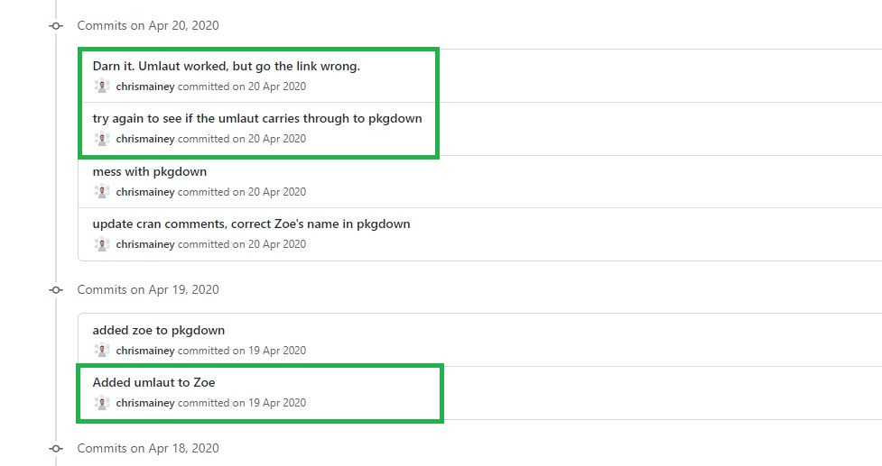
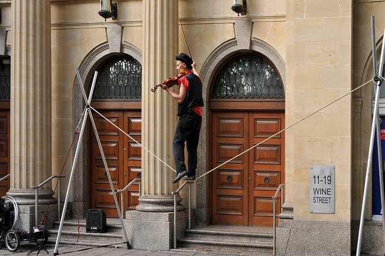
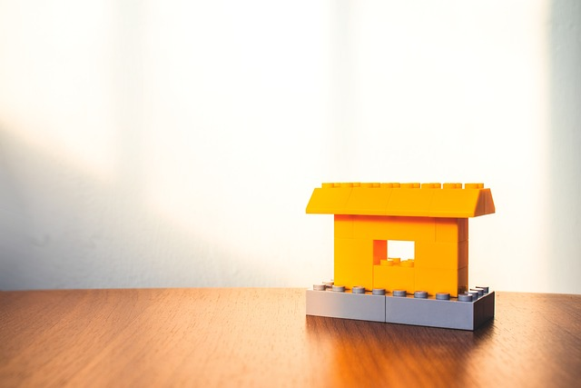
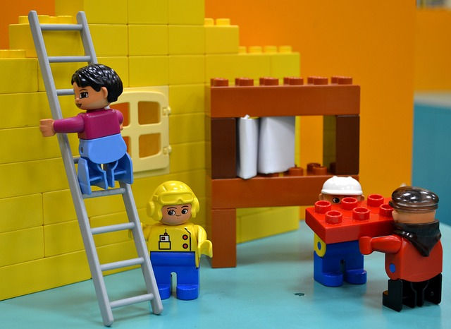
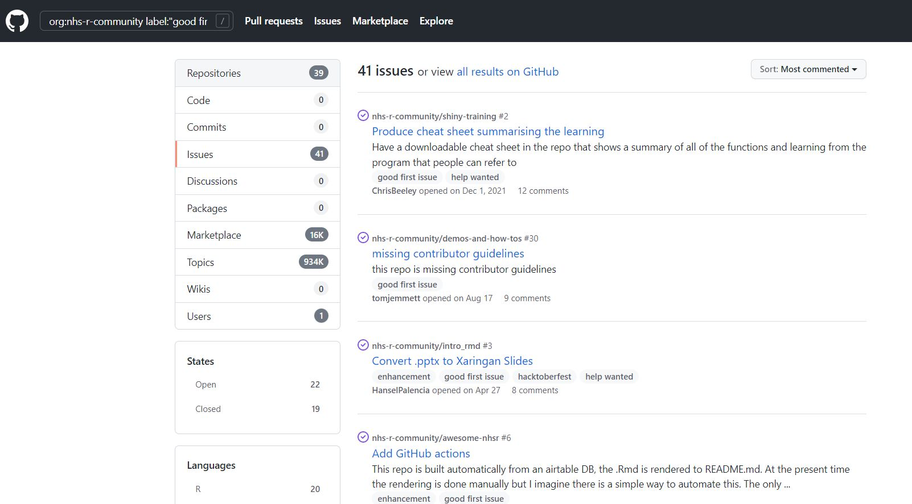
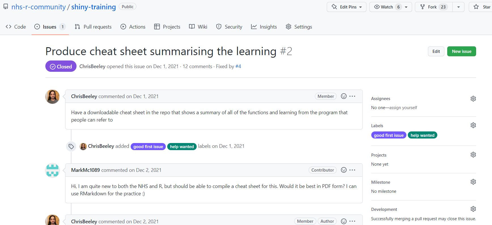
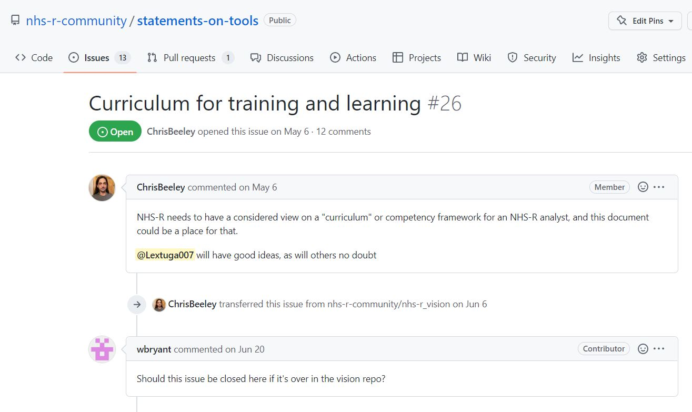

class: title-slide, left, bottom

```{r setup, include = FALSE}
library(knitr)
library(tidyverse)

### Packages not on CRAN ###

# install.packages("remotes")
# remotes::install_github("mitchelloharawild/icons")
library(icons) # icons need to be loaded to view so run following code if not already done
# icons::download_fontawesome()

# install.packages("devtools")
#devtools::install_github("gadenbuie/xaringanExtra")
library(xaringanExtra)
xaringanExtra::use_share_again() # need to get the slide button on html view

# set default options
opts_chunk$set(echo = FALSE,
               fig.width = 7.252,
               fig.height = 4,
               dpi = 300,
               dev.args = list(type = "cairo"),
               eval = TRUE,
               warning = FALSE,
               message = FALSE,
               error = FALSE)

```

```{r echo=FALSE}
# Adds logo to all slides

xaringanExtra::use_logo(
  image_url = "https://cdu-data-science-team.github.io/assets/logo/nottshc-cdu-data-science-logo-800.png",
  link_url = "https://cdu-data-science-team.github.io/team-blog/",
  exclude_class = c("inverse", "hide-logo"),
  width = "300px",
  height = "200px",
  position = css_position(top = "0em", right = "0em")
)
```

# `r rmarkdown::metadata$title`
----
## **`r rmarkdown::metadata$subtitle`**
### `r rmarkdown::metadata$author` | `r format(Sys.time(), '%B %Y')` 


???
I'd like to welcome you to my brief talk on creating packages - the NHSR way.

My name is...
---
class: middle, center, inverse

background-image: url(img/architecture.jpg)
background-size: cover

</br>
# In the beginning

.pull-right[
## When packages were what other people built...
]

???

Let's start with a story! In the beginning...

It seems a very strange thing to even consider building a package when learning R as there are so many out there already. 

But there is always room for more packages and whilst some are a collection of functions that do things...

Alt text: a walkway in a building which is made up of quarter curved pillars. A person is walking beneath these pillars.

---
class: inverse-white, middle

# NHSRdatasets

Some packages hold data

--

Jul 2019 - the first commit with Length of stay data  

--

Aug 2019 - Accident and Emergency attendance data added  

--

.green[Apr 2020 - Office of National Statistics provisional deaths data added  ] - my contribution

???

ONS data comes in wide form (human friendly) and kept in separate files per year.

I had existing code to move this to long form and merge the years together (pre-covid which had additional information)

--

Mar 2021 - Synthetic National Early Warning Score data added  

--


Seems a smooth process looking back at the commit history but...


---
class: middle, center, inverse

background-image: url(img/construction_transparent.jpg)
background-size: cover

</br>
</br>
</br>
# I had lots of help

???

Whilst I had the files already prepared from a regular report I did:

* R code - to take a wide form ONS dataset to long form
* outputs - csv and RData

Image Alt text: three people with hard hats with one arm up guiding a block of concrete.

---

# Looks like it wasn't just me learning!



---

# Learning takes patience

From the learner...

--

... and also the people supporting 


???

I needed to get my code into GitHub, do a pull request

I didn't know my README.md from my README.Rmd

I felt like I was committing and pushing blindly but always with the safety net of the Community guiding me 

---

# Fast forward to today

This positive experience helped me take over an internal package in my team


---
class: middle, hide-logo

.pull-left[

# And contributed to others

### Packages
[{dataCompareR}](https://github.com/capitalone/dataCompareR) - updated test documentation  
[{praise}](https://github.com/rladies/praise) - removed one word and added two praises  
[{hugo-apero}](https://github.com/hugo-apero/hugo-apero) - updated text  


### Sites and repositories
[distillery](https://github.com/Lextuga007/distillery) - added my team's and my distill sites  
[data-hazards repo](https://github.com/very-good-science/data-hazards) - corrections  
[data-ethics-club repo](https://github.com/very-good-science/data-ethics-club) - Twitter url correction
]

--

.pull-right[
None of these are big contributions, in fact they are very small


]
---

class: middle, center, inverse

background-image: url(img/park-guell-transparent.jpg)
background-size: cover

# Do you want to join in?


---

class: hide-logo

.pull-left[
# The <a alt="NHS-R Community" href='https://nhsrcommunity.com/'></a> way


]

--

.pull-right[

# Contribute to existing packages

[{NHSRdatasets}](https://github.com/nhs-r-community/NHSRdatasets)  
[{NHSRplotthedots}](https://github.com/nhs-r-community/NHSRplotthedots)  
[{NHSRtheme}](https://github.com/nhs-r-community/NHSRtheme)  
[{NHSRtraining}](https://github.com/nhs-r-community/NHSRtraining)  
[{NHSRpopulation}](https://github.com/nhs-r-community/NHSRpopulation)  
[universe](https://github.com/nhs-r-community/universe)

## Or suggest new packages!

[`r icons::fontawesome("twitter")` @NHSrCommunity](https://twitter.com/NHSrCommunity)  
[`r icons::fontawesome("slack")` NHS-R Community Slack](https://nhsrcommunity.slack.com/)  
[`r icons::fontawesome("paper-plane")` nhs.rcommunity@nhs.net](mailto:nhs.rcommunity@nhs.net)
]

???
It's not just about code, we need designers for things like hex logos.

Recently had a conversation about the NHSRplotthedots logo via Twitter, Slack and GitHub pulling together ideas from people with no R coding knowledge and no GitHub account.

---

class: hide-logo

# Finding issues to contribute to

We use the label "Good first issue" and "Help wanted" in the NHS-R Community GitHub

[](https://github.com/search?o=desc&q=org%3Anhs-r-community+label%3A%22good+first+issue%22&s=comments&type=Issues)

---

class: hide-logo

# Conversations in issues

[](https://github.com/nhs-r-community/shiny-training/issues/2)

---

class: hide-logo

# Issues that are just conversations

[](https://github.com/nhs-r-community/statements-on-tools/issues/26)

---

# NHS-R Community way

Is about values: community, openness and learning


???

We are a community bringing differences of experiences and skills together which change over time. 

I started out not knowing anything about packages but with support now maintain my own

---


---

class: inverse

name: acknowledgement

# Acknowledgments

Acknowledgements: the professional look of this presentation, using NHS and Nottinghamshire Healthcare NHS Foundation Trust colour branding, exists because of the amazing work of Silvia Canelón, details of the workshops she ran at the [NHS-R Community conference](https://spcanelon.github.io/xaringan-basics-and-beyond/index.html), Milan Wiedemann who created the CDU Data Science logo with the help of the team.

[`r icons::fontawesome("twitter")` @DataScienceNott](https://twitter.com/DataScienceNott)  
[`r icons::fontawesome("github")` Clinical Development Unit Data Science Team](https://github.com/CDU-data-science-team)  
[`r icons::fontawesome("paper-plane")` cdudatascience@nottshc.nhs.uk](mailto:cdudatascience@nottshc.nhs.uk)

Images:
Image by <a href="https://pixabay.com/users/evgenit-4930349/?utm_source=link-attribution&amp;utm_medium=referral&amp;utm_campaign=image&amp;utm_content=3488306">Evgeni Tcherkasski</a> from <a href="https://pixabay.com//?utm_source=link-attribution&amp;utm_medium=referral&amp;utm_campaign=image&amp;utm_content=3488306">Pixabay</a>

Image by <a href="https://pixabay.com/users/danisampa-2012007/?utm_source=link-attribution&amp;utm_medium=referral&amp;utm_campaign=image&amp;utm_content=1181982">Daniele Longo</a> from <a href="https://pixabay.com//?utm_source=link-attribution&amp;utm_medium=referral&amp;utm_campaign=image&amp;utm_content=1181982">Pixabay</a>

Image by <a href="https://pixabay.com/users/ralfgervink-6522908/?utm_source=link-attribution&amp;utm_medium=referral&amp;utm_campaign=image&amp;utm_content=2791879">Ralf Gervink</a> from <a href="https://pixabay.com//?utm_source=link-attribution&amp;utm_medium=referral&amp;utm_campaign=image&amp;utm_content=2791879">Pixabay</a>

Image by <a href="https://pixabay.com/users/denisdoukhan-607002/?utm_source=link-attribution&amp;utm_medium=referral&amp;utm_campaign=image&amp;utm_content=735413">Denis Doukhan</a> from <a href="https://pixabay.com//?utm_source=link-attribution&amp;utm_medium=referral&amp;utm_campaign=image&amp;utm_content=735413">Pixabay</a>

Image by <a href="https://pixabay.com/users/aldarami-18973239/?utm_source=link-attribution&amp;utm_medium=referral&amp;utm_campaign=image&amp;utm_content=5754236">Aldair Velázquez Ramírez</a> from <a href="https://pixabay.com//?utm_source=link-attribution&amp;utm_medium=referral&amp;utm_campaign=image&amp;utm_content=5754236">Pixabay</a>

Image by <a href="https://pixabay.com/users/loggawiggler-15/?utm_source=link-attribution&amp;utm_medium=referral&amp;utm_campaign=image&amp;utm_content=5249">LoggaWiggler</a> from <a href="https://pixabay.com//?utm_source=link-attribution&amp;utm_medium=referral&amp;utm_campaign=image&amp;utm_content=5249">Pixabay</a>

Image by <a href="https://pixabay.com/users/sttimm-265330/?utm_source=link-attribution&amp;utm_medium=referral&amp;utm_campaign=image&amp;utm_content=516559">Steffi Timm</a> from <a href="https://pixabay.com//?utm_source=link-attribution&amp;utm_medium=referral&amp;utm_campaign=image&amp;utm_content=516559">Pixabay</a>

Image by <a href="https://pixabay.com/users/geralt-9301/?utm_source=link-attribution&amp;utm_medium=referral&amp;utm_campaign=image&amp;utm_content=2709670">Gerd Altmann</a> from <a href="https://pixabay.com//?utm_source=link-attribution&amp;utm_medium=referral&amp;utm_campaign=image&amp;utm_content=2709670">Pixabay</a>