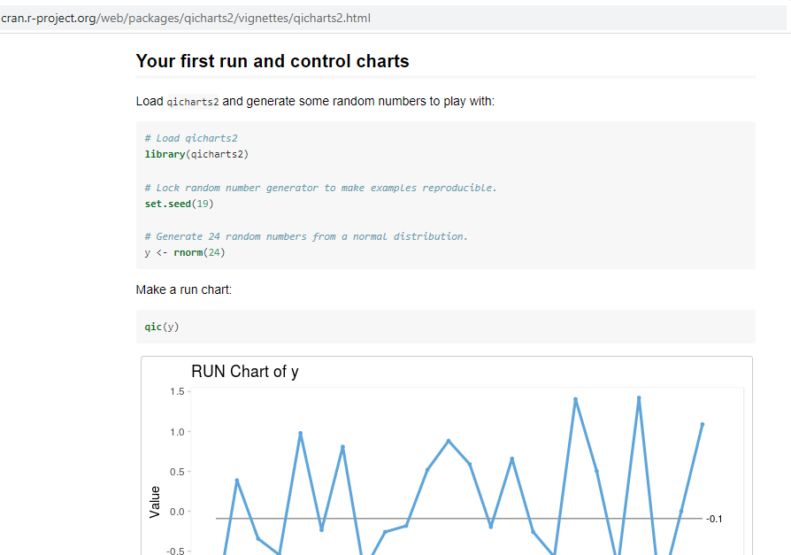
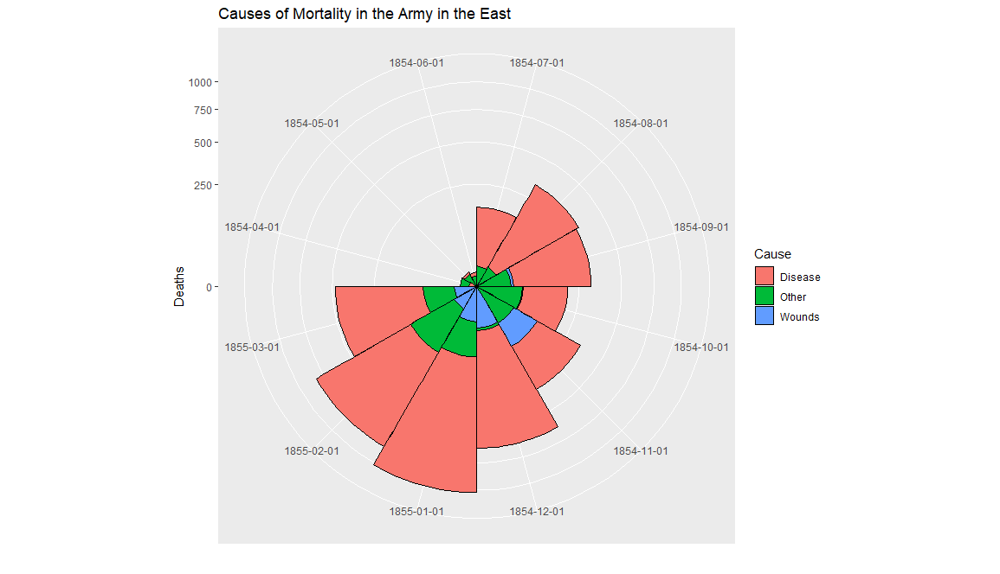

```{r libs, include=FALSE}

knitr::opts_chunk$set(echo = FALSE, message = FALSE, warning = FALSE, results = 'asis')

library(dplyr)
library(readxl)
library(qicharts2)
library(lubridate)
library(pander)

```


## Questions | Because I always forget this part... 

* Who uses Statistical Process Control charts?

    (or run charts and funnel plots)

* Who has used qicharts2 package in R?


## Package details {.flexbox .vcenter}

```{r package, echo=TRUE, eval=FALSE}

install.packages("qicharts2")

library(qicharts2)

```

- Available on CRAN

- Comes with sample healthcare datasets 

- Created by Jacob Anhøj, a doctor in Denmark

- Supercedes qichart package


# Why I like this package ...


## Reasons to be joyful {.flexbox .vcenter}

* I skim instructions

* I just _get_ healthcare data (not plants and certainly not cars)

* Reproducible examples in the vignette

* More than one type of SPC available


## Like this | Snapshot of the vignette:

```{r Run, out.width = "1000px"}



```

# Nightingale's Crimea...


## Getting data { .vcenter}

Copied data manually from: https://understandinguncertainty.org/node/214

library(datapasta) to copy directly to R

Saved in a script for quick retrieval later

```{r Crimea, echo=TRUE, results='hide'}

source("Crimea.R")

```

## Being #rstats though

```{r data, echo=TRUE, eval=FALSE}

install.packages("HistData")

library(HistData)

data("Nightingale")


```

```{r Crimea pic}



```

# Replot in qicharts2

## Run chart code

Built on ggplot2 

```{r Crimea run, echo=TRUE, eval=FALSE}

qic(startMonth,number,
    data     = crimeaLong,
    chart    = 'run',
    decimals = 0, 

    x.angle  = 90,
    title    = 'Run chart deaths in Crimea War',
    ylab     = 'Number of deaths',
    xlab     = 'Month'
)

```

## Produces this

```{r Crimea run chart}

qic(startMonth,number,
    data     = crimeaLong,
    chart    = 'run',
    decimals = 0, 

    x.angle  = 90,
    title    = 'Run chart deaths in Crimea War',
    ylab     = 'Number of deaths',
    xlab     = 'Month'
)
```

# Sprinkle ggplot2 magic...

## Facets

```{r Crimea run facet chart}

qic(startMonth,number,
    data     = crimeaLong,
    chart    = 'run',
    decimals = 0, 
    facets   = ~death_cause,
    x.angle  = 90,
    title    = 'Run chart deaths in Crimea War',
    ylab     = 'Number of deaths',
    xlab     = 'Month'
)

```

# Just imagine...

Producing... 

* 30 incident categories

* 10 wards

* 25 LSOAs

To look for signals

## The magic is one line of code

```{r Crimea run facet, echo=TRUE, eval=FALSE}

qic(startMonth,number,
    data     = crimeaLong,
    chart    = 'run',
    decimals = 0, 

    x.angle  = 90,
    title    = 'Run chart deaths in Crimea War',
    ylab     = 'Number of deaths',
    xlab     = 'Month'
)

```

## With the facet line

```{r Show facet line, echo=TRUE, eval=FALSE}

qic(startMonth,number,
    data     = crimeaLong,
    chart    = 'run',
    decimals = 0, 
    facets   = ~death_cause,
    x.angle  = 90,
    title    = 'Run chart deaths in Crimea War',
    ylab     = 'Number of deaths',
    xlab     = 'Month'
)

```

## Moving Range SPC

```{r mr Chart code, echo=TRUE, eval=FALSE}

qic(startMonth,number,
    data     = crimeaLong,
    chart    = 'mr',
    decimals = 0, 
    facet    = ~death_cause,
    x.angle  = 90,
    title    = 'SPC mr chart deaths in Crimea War',
    ylab     = 'Number of deaths',
    xlab     = 'Month'
)

```

## mr Chart (or is that Mr Chart!)

As seen on Twitter @Letxuga007  

```{r mr Chart}

qic(startMonth,number,
    data     = crimeaLong,
    chart    = 'mr',
    decimals = 0, 
    facet    = ~death_cause,
    x.angle  = 90,
    title    = 'SPC mr chart deaths in Crimea War',
    ylab     = 'Number of deaths',
    xlab     = 'Month'
)

```

# Other SPC charts are available

## Rare events - time between

The code requires a count of days difference.

Cabg = coronary artery bypass operations

```{r cabg, echo = TRUE}

# Altered slightly from the vignette

fatalities <- cabg %>% 
  filter(death) %>% 
  mutate(dt = date - lag(date))

```

## T-chart

A point above the upper control limit is a good thing!

```{r cabg chart}

tchart <- qic(dt,
    data  = fatalities,
    chart = 't',
    title = 'Days between deaths (T chart)',
    ylab  = 'Days',
    xlab  = 'Death #')

tchart
```

# Breaking into the chart

## Getting the data

The numbers generated to create the charts can be viewed/saved by typing:

```{r Chart code, echo=TRUE}

newObject <- tchart$data

```

## When is this useful?

In this blog: https://www.r-bloggers.com/backed-by-data/ @_johnmackintosh shows how to:

* tweak the charts

And I used this code

* to include only those charts with a signal

# Other interesting things

## Further information

Jacob has created this Flexdashboard https://hospinf.shinyapps.io/hospinf/ 

SPC Shiny dashboards are being discussed on the NHS-R Slack site 

- please join us and contribute 

 link: nhsrcommunity.slack.com 

- Twitter: @NHSrCommunity
- Our Team: @DataScienceNott
- Me: @Letxuga007

Follow the hashtag #rstats
