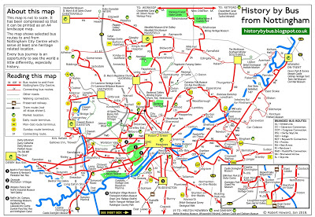
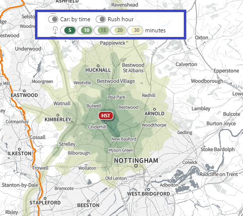
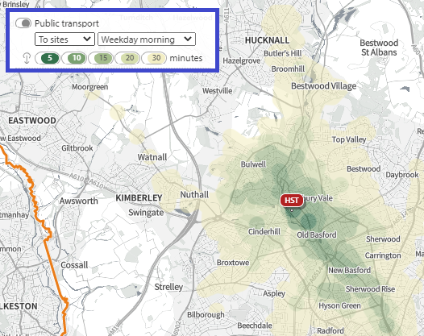
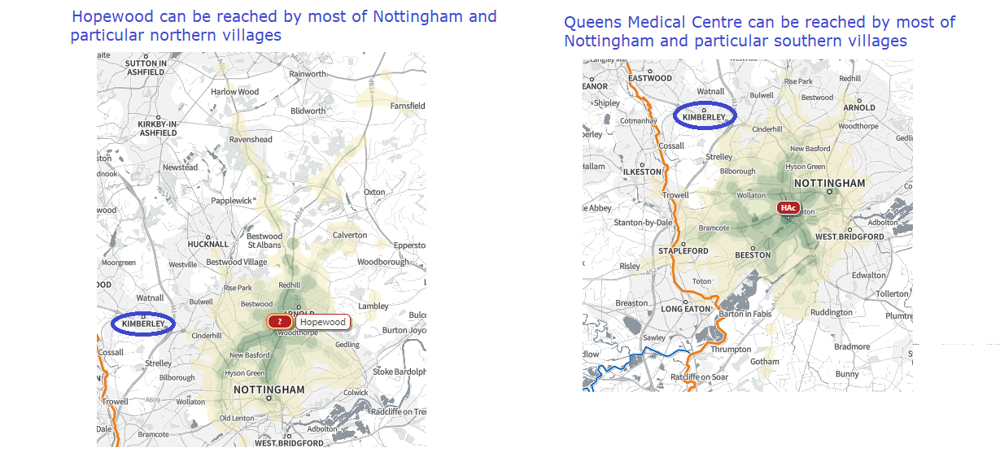
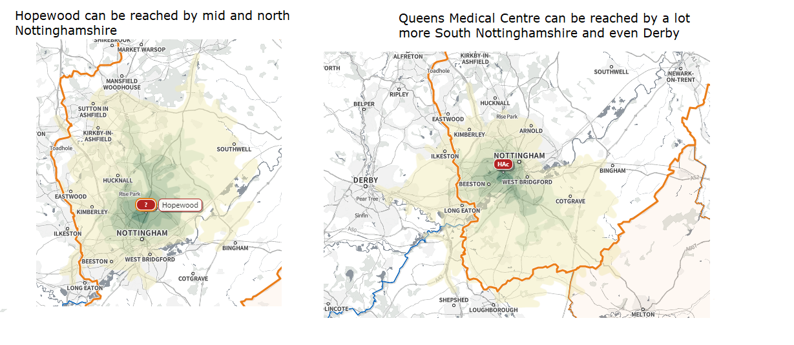
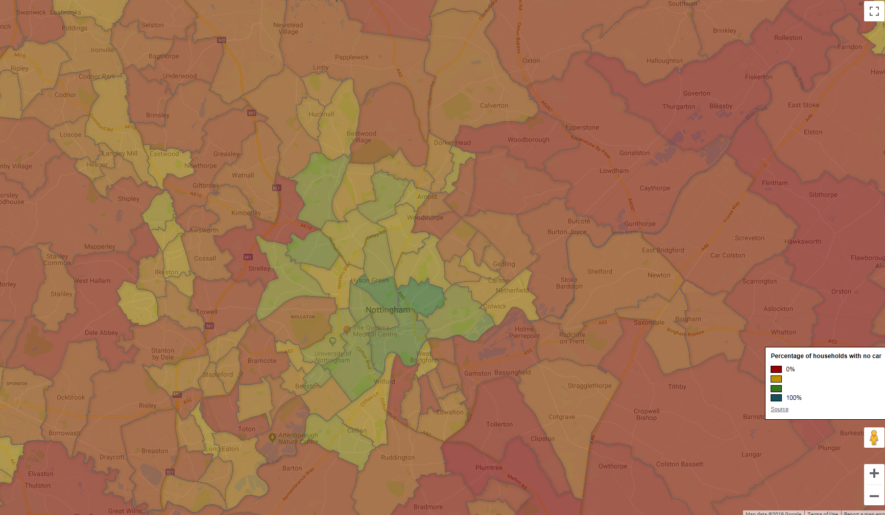
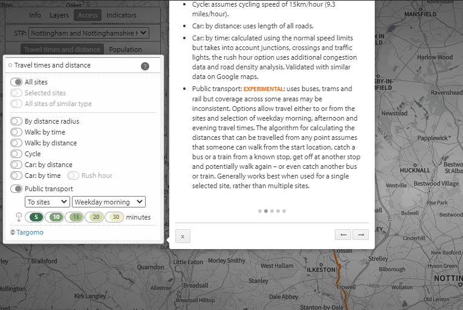

class: title-slide, left, bottom

```{r setup, include = FALSE}
library(knitr)
library(tidyverse)
library(here)
### Packages not on CRAN ###

# install.packages("remotes")
# remotes::install_github("mitchelloharawild/icon")
library(icon) # icons need to be loaded to view so run following code if not already done
# icon::download_fontawesome()

# install.packages("devtools")
#devtools::install_github("gadenbuie/xaringanExtra")
library(xaringanExtra)
xaringanExtra::use_share_again() # need to get the slide button on html view
xaringanExtra::use_scribble(pen_color = "#003087") # add pens to slides

# install.packages("devtools")
# devtools::install_github('nhs-r-community/nhsrtheme')
library(nhsrtheme)

source(here("shape-public-transport", "treemap-vehicle-access-2011.R"))

# set default options
opts_chunk$set(echo = FALSE,
               fig.width = 7.252,
               fig.height = 4,
               dpi = 300,
               dev.args = list(type = "cairo"),
               eval = TRUE,
               warning = FALSE,
               message = FALSE,
               error = FALSE)

# uncomment the following lines if you want to use the NHS-R theme colours by default
# scale_fill_continuous <- partial(scale_fill_nhs, discrete = FALSE)
# scale_fill_discrete <- partial(scale_fill_nhs, discrete = TRUE)
# scale_colour_continuous <- partial(scale_colour_nhs, discrete = FALSE)
# scale_colour_discrete <- partial(scale_colour_nhs, discrete = TRUE)

```

```{r echo=FALSE}
xaringanExtra::use_logo(
  image_url = "img/nottshc.PNG",
  exclude_class = c("title-slide", "inverse", "hide-logo"),
  width = "300px",
  height = "200px",
  position = css_position(top = "0em", right = "1em")
)

```


# `r rmarkdown::metadata$title`
----
## **`r rmarkdown::metadata$subtitle`**
### `r rmarkdown::metadata$author` | `r rmarkdown::metadata$date`
</br>

---
class: inverse, middle, center

# Public Transport and access

---
class: middle

# Background

* Pre-Covid I was an avid public transport user
* Nottingham/shire public transport system is radial 
* All buses and trams go to the centre and (almost) to the Acute hospital

[](http://historybybus.blogspot.com/)

---
class: inverse-white, center

# As the crow flies

A lot of people drive... Highbury Hospital (a Mental Health Hospital)



.footnote[© Crown copyright and database rights 2021 Ordnance Survey 100016969]

---
class: inverse-white, center

# As the crow flies

A great majority of people people who commission services don't use public transport



.footnote[© Crown copyright and database rights 2021 Ordnance Survey 100016969]
---

class: inverse-white

# Public Transport comparison

Nottinghamshire Healthcare NHS Foundation Trust moved services from the Acute Hospital to a purpose built building. 

How would this affect people travelling by public transport?



.footnote[© Crown copyright and database rights 2021 Ordnance Survey 100016969]
---

class: inverse-white

# Drive time comparison



.footnote[© Crown copyright and database rights 2021 Ordnance Survey 100016969]
---

# Does public transport matter?

What do the general public use?

[](https://datashine.org.uk/)

---

class: inverse-white


```{r nottingham-treemap}

# Treemap showing the percentage breakdown of the vehicle ownership with no cars or vans in Nottingham being reported by 43.7% of households in the 2011 census
nottingham
```

---

class: inverse-white

```{r nottinghamshire-treemap}

# Treemap showing the percentage breakdown of the vehicle ownership with no cars or vans in Nottinghamshire being reported by 20.8% of households in the 2011 census
nottinghamshire
```

---

# Challenges using SHAPE

1. The colours for 30 minutes areas are pale

--

1. Colours for travel time can't be changed

--

1. Sizing of the map showing varies according to the detail - images are not like for like

--

1. Copying and pasting is clunky (used Snipping Tool)

---

# Great features of SHAPE

1. Public sector facilities are all available (Nottshc has 378 sites)

--

1. It's possible to add new facilities manually 

--

1. It's a great exploratory tool

--

1. It's free to public sector and it has been updated so is well supported

--

1. It's much more than a transport mapping tool of course!

--

1. The site is great for staying logged into and remembering your password. It's a small thing but I do appreciate this a lot.

---

class: inverse-white

# Download data

It's possible to download the data for the travel times but note this needs to be done by each time travel segment and selection of population is required before the Export button appears.

```{r, out.width="49%", out.height="20%", alt="Images of the selections on travel time of 30 minutes and full population to show the menu requrired to get the export button next to an image of the extracted data"}

knitr::include_graphics(c("img/export-travel-data.PNG","img/export-travel-extract.PNG"))
```

---

class: inverse-white

# Data help

Information on the methodology and limitations is comprehensive:



---

# Extract of methodology

</br>
</br>
</br>

> Public transport: EXPERIMENTAL: uses buses, trams and rail but coverage across some areas may be inconsistent. Options allow travel either to or from the sites and selection of weekday morning, afternoon and evening travel times. The algorithm for calculating the distances that can be travelled from any point assumes that someone can walk from the start location, catch a bus or a train from a known stop, get off at another stop and potentially walk again – or even catch another bus or train. Generally works best when used for a single selected site, rather than multiple sites.

---

# Accessiblity

The [accessibility statement](https://shapeatlas.net/accessibility-statement/) is on the [front page](https://shapeatlas.net/) before logging in and is located on the side bar. 

Once logged in though it isn't clear how to get back to this front page.

To get around this open in a different browser (particularly if the remember password has been selected!)

---

class: inverse

name: acknowledgement

# Acknowledgments

Acknowledgements: the professional look of this presentation, using NHS and Nottinghamshire Healthcare NHS Foundation Trust colour branding, exists because of the amazing work of Silvia Canelón, details of the workshops she ran at the [NHS-R Community conference](https://spcanelon.github.io/xaringan-basics-and-beyond/index.html).

[`r icon::fontawesome("twitter")` @DataScienceNott](https://twitter.com/DataScienceNott)<br/>
[`r icon::fontawesome("github")` Clinical Development Unit Data Science Team](https://github.com/CDU-data-science-team)<br/>
[`r icon::fontawesome("paper-plane")` zoe.turner2@notthshc.nhs.uk](mailto:zoe.turner2@nottshc.nhs.uk)
