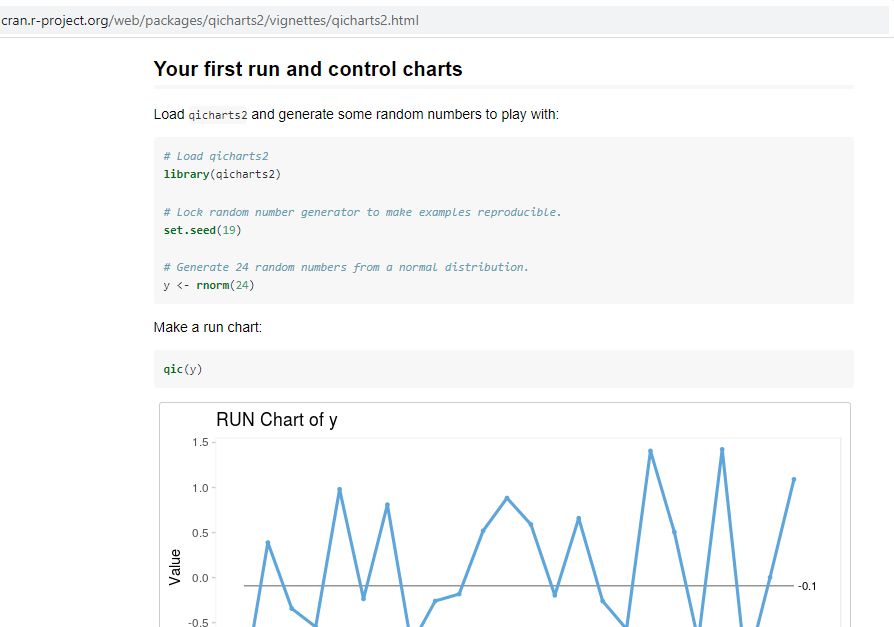

class: title-slide, left, bottom
```{r setup, include = FALSE}
library(knitr)
library(tidyverse)
library(nhsrtheme)
library(xaringanExtra)
# set default options
opts_chunk$set(echo = FALSE,
               fig.width = 7.252,
               fig.height = 4,
               dpi = 300,
               dev.args = list(type = "cairo"),
               echo = TRUE,
               warning = FALSE,
               message = FALSE,
               error = FALSE)

# uncomment the following lines if you want to use the NHS-R theme colours by default
# scale_fill_continuous <- partial(scale_fill_nhs, discrete = FALSE)
# scale_fill_discrete <- partial(scale_fill_nhs, discrete = TRUE)
# scale_colour_continuous <- partial(scale_colour_nhs, discrete = FALSE)
# scale_colour_discrete <- partial(scale_colour_nhs, discrete = TRUE)

library(xaringanExtra)
xaringanExtra::use_share_again() # need to get the slide button on html view
```

```{r echo=FALSE}
xaringanExtra::use_logo(
  image_url = "img/logo-nhs-blue.png",
  exclude_class = c("title-slide", "inverse", "hide-logo")
)
```


# `r rmarkdown::metadata$title`
----
## **`r rmarkdown::metadata$subtitle`**
### `r rmarkdown::metadata$author`
### `r rmarkdown::metadata$date`

---

## Package details

```{r package, eval=FALSE}
install.packages("qicharts2")
library(qicharts2)
```

</br>

- Available on CRAN

- Comes with sample healthcare datasets 

- Created by Jacob Anhøj, a doctor in Denmark


---

# Why I like this package ...

## Reasons to be joyful 

* I skim instructions

* I just _get_ healthcare data (not plants and certainly not cars)

* Reproducible examples in the vignette

* More than one type of SPC available

---

## Like this | Snapshot of the vignette:

```{r run-chart, out.width = "1000px", echo=FALSE}

```

---

# Nightingale's Crimea...

## Getting data

Copied data manually from this [site](https://understandinguncertainty.org/node/214)

using a GUI (graphical user interface) package called `library(datapasta)` to copy directly to R

Saved in a script for quick retrieval later

```{r crimea, results='hide'}
source("Crimea.R")
```

---

## Being #rstats

There is a package for that... even for historical data!

```{r data, eval=FALSE}
install.packages("HistData")
library(HistData)

data("Nightingale")
```

---

## And the coxcomb can be recreated...

### ... and animated as a GIF

Credit: Sian Bladon, Winner of the most [innovative FloViz Competition 2020 ](https://statsyss.wordpress.com/2020/05/11/floviz-challenge-entries/) from the Young Statisticians Section of the Royal Statistical Society

```{r crimea-pic, echo=FALSE, fig.align="center"}

knitr::include_graphics("https://github.com/sianbladon/Data-Viz/blob/master/FloViz-Challenge-May-2020/floviz.gif?raw=true")

```

---

# Replot in qicharts2

## Run chart code

Built on ggplot2 

```{r crimea-run, eval=FALSE}

qic(startMonth,number,
    data     = crimeaLong,
    chart    = 'run',
    decimals = 0, 
    x.angle  = 90,
    title    = 'Run chart deaths in Crimea War',
    ylab     = 'Number of deaths',
    xlab     = 'Month'
)

```

---

# Replot in qicharts2

## Run chart code

```{r ref.label="crimea-run", echo=FALSE}

```

---

# Sprinkle ggplot2 magic...

## Facets

```{r crimea-run-facet-chart, eval=FALSE}

qic(startMonth,number,
    data     = crimeaLong,
    chart    = 'run',
    decimals = 0, 
    facets   = ~death_cause, #<<
    x.angle  = 90,
    title    = 'Run chart deaths in Crimea War',
    ylab     = 'Number of deaths',
    xlab     = 'Month'
)

```

---

# Sprinkle ggplot2 magic...

## Facets

```{r ref.label="crimea-run-facet-chart", echo=FALSE}

```


---

# Just imagine...

Producing... 

* 30 incident categories

--

* 10 wards

--

* 25 LSOAs

--

Looking for for signals. That's a lot of individual plots to do in SQL or Excel. 

---

## Moving Range SPC

```{r mr-spc-code, eval=FALSE}

qic(startMonth,number,
    data     = crimeaLong,
    chart    = 'mr', #<<
    decimals = 0, 
    facet    = ~death_cause,
    x.angle  = 90,
    title    = 'SPC mr chart deaths in Crimea War',
    ylab     = 'Number of deaths',
    xlab     = 'Month'
)

```

---

## mr Chart (or is that Mr Chart!)

As seen on Twitter @Letxuga007  

```{r ref.label="mr-spc-code", echo=FALSE}

qic(startMonth,number,
    data     = crimeaLong,
    chart    = 'mr',
    decimals = 0, 
    facet    = ~death_cause,
    x.angle  = 90,
    title    = 'SPC mr chart deaths in Crimea War',
    ylab     = 'Number of deaths',
    xlab     = 'Month'
)

```

---

# Other SPC charts are available

## Rare events - time between

The code requires a count of days difference.

.footnote[Cabg = coronary artery bypass operations]

```{r cabg}

# Altered slightly from the qicharts2 vignette

fatalities <- cabg %>% 
  filter(death) %>% 
  mutate(dt = date - lag(date))

```

---

## T-chart

Time between used for rare events like deaths from operations

```{r cabg-code, eval=FALSE}

tchart <- qic(dt,
    data  = fatalities,
    chart = 't', #<<
    title = 'Days between deaths (T chart)',
    ylab  = 'Days',
    xlab  = 'Death #')

tchart

```

---

## T-chart

A point above the upper control limit is a good thing!


```{r ref.label="cabg-code", echo=FALSE}

```

---

# Breaking into the chart

## Getting the data

The numbers generated to create the charts can be viewed/saved by typing:

```{r Chart code, echo=TRUE}

newObject <- tchart$data

```

---

## When is this useful?

In this blog: https://www.r-bloggers.com/backed-by-data/ @_johnmackintosh shows how to:

* tweak the charts

--

<br>

And I used this code

* to include only those charts with a signal
* to link back to the data to say which patients/incidents/wards were behind the points. This data can be automatically generated in a report

--

John Mackintosh has also created 2 specific R packages:

[runcharter](https://github.com/johnmackintosh/runcharter) </br>
--
[spccharter](https://github.com/johnmackintosh/spccharter)

---

# Other interesting things

## Further information

SPC Shiny dashboards are being discussed on the NHS-R Slack site in the channel #proj-shiny-spc

Will be based on some of the work started by [Chris Reading](https://github.com/chrisreading01/SPCwizard) ([patch](https://github.com/ChrisBeeley/SPCwizard/tree/patch-1) by Chris Beeley) and Simon Wellesley-Miller.

- please join us and contribute 

 link: [nhsrcommunity.slack.com](nhsrcommunity.slack.com) 

- Twitter: [@NHSrCommunity](https://twitter.com/NHSrCommunity)
- Me: [@Letxuga007](https://twitter.com/Letxuga007)


.footnote[The **nhsr theme** was designed by [Silvia Canelon](https://silvia.rbind.io) for, and with feedback from, the [NHS-R Community](https://github.com/nhs-r-community), following the [NHS identity guidelines](https://www.england.nhs.uk/nhsidentity/identity-guidelines/).]
